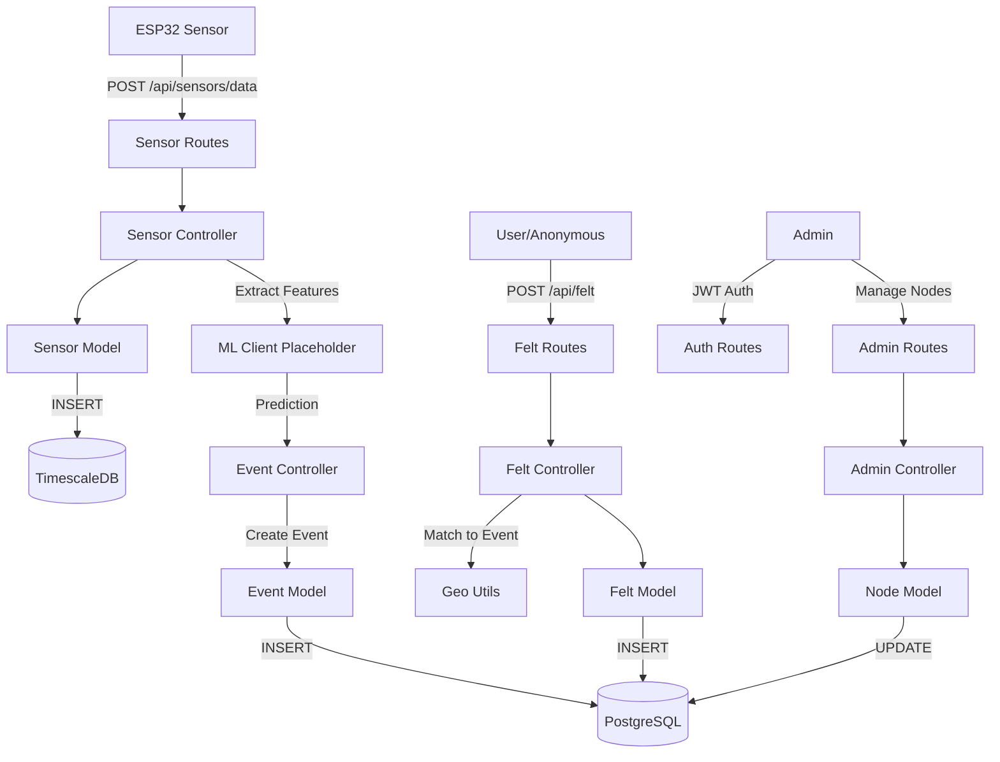

# Sei

smic Sensor Network Backend Implementation Plan

## Technology Stack

- **Runtime**: Node.js with Express.js
- **Database**: PostgreSQL with TimescaleDB extension
- **Authentication**: JWT (JSON Web Tokens)
- **Database Client**: `pg` library (raw SQL)
- **Validation**: `joi` or `express-validator`
- **Security**: `bcrypt` for password hashing, `helmet` for security headers
- **Logging**: `winston` for structured logging
- **Environment**: `dotenv` for configuration

## Database Schema Design

### Core Tables

1. **sensor_nodes** - Registered ESP32 sensor nodes

- id (UUID, primary key)
- node_id (string, unique) - ESP32 identifier
- name (string)
- latitude (decimal)
- longitude (decimal)
- elevation (decimal, optional)
- status (enum: active, inactive, maintenance)
- last_heartbeat (timestamp)
- created_at (timestamp)
- updated_at (timestamp)

2. **sensor_data** - Time-series accelerometer data (TimescaleDB hypertable)

- time (timestamp, primary key)
- node_id (UUID, foreign key)
- x_axis (decimal) - acceleration in g
- y_axis (decimal)
- z_axis (decimal)
- magnitude (decimal) - calculated sqrt(x²+y²+z²)
- sampling_rate (integer)

3. **events** - Detected seismic events

- id (UUID, primary key)
- event_type (enum: earthquake, noise, unknown) - from ML placeholder
- confidence (decimal 0-1) - ML confidence score
- magnitude_estimate (decimal, optional)
- latitude (decimal) - epicenter estimate
- longitude (decimal)
- detected_at (timestamp)
- status (enum: pending, confirmed, false_positive)
- created_at (timestamp)

4. **event_detections** - Links sensor data to events

- id (UUID, primary key)
- event_id (UUID, foreign key)
- node_id (UUID, foreign key)
- detection_time (timestamp)
- peak_acceleration (decimal)
- distance_from_epicenter (decimal, optional)

5. **felt_reports** - Crowdsourced "Felt-It" reports

- id (UUID, primary key)
- user_id (UUID, foreign key, nullable) - null for anonymous
- event_id (UUID, foreign key, nullable) - matched event
- latitude (decimal)
- longitude (decimal)
- intensity (integer 1-10) - Modified Mercalli scale
- description (text, optional)
- is_anonymous (boolean)
- reported_at (timestamp)
- created_at (timestamp)

6. **users** - Registered users (for felt reports)

- id (UUID, primary key)
- email (string, unique)
- password_hash (string)
- name (string, optional)
- role (enum: user, admin)
- created_at (timestamp)
- updated_at (timestamp)

7. **predictions** - ML model predictions (placeholder)

- id (UUID, primary key)
- node_id (UUID, foreign key)
- data_segment_id (string) - reference to sensor data
- prediction (string) - earthquake/noise/unknown
- confidence (decimal 0-1)
- features (jsonb) - extracted features
- created_at (timestamp)

8. **admin_logs** - Audit trail for admin actions

- id (UUID, primary key)
- admin_id (UUID, foreign key)
- action (string)
- resource_type (string)
- resource_id (UUID)
- details (jsonb)
- created_at (timestamp)

### TimescaleDB Setup

- Convert `sensor_data` table to hypertable with time partitioning
- Create continuous aggregates for real-time statistics
- Indexes on node_id, time, and magnitude for fast queries

## Folder Structure

```javascript
backend/
├── src/
│   ├── app.js                 # Express app setup
│   ├── server.js              # Server entry point
│   │
│   ├── config/
│   │   ├── db.js              # PostgreSQL connection pool
│   │   ├── timescale.js       # TimescaleDB setup & migrations
│   │   └── jwt.js             # JWT configuration
│   │
│   ├── routes/
│   │   ├── sensor.routes.js   # Sensor data & heartbeat endpoints
│   │   ├── event.routes.js    # Event retrieval endpoints
│   │   ├── felt.routes.js     # Felt-It report endpoints
│   │   ├── auth.routes.js     # Authentication endpoints
│   │   └── admin.routes.js    # Admin management endpoints
│   │
│   ├── controllers/
│   │   ├── sensor.controller.js
│   │   ├── event.controller.js
│   │   ├── felt.controller.js
│   │   ├── auth.controller.js
│   │   └── admin.controller.js
│   │
│   ├── models/
│   │   ├── sensorData.model.js
│   │   ├── sensorNode.model.js
│   │   ├── event.model.js
│   │   ├── feltReport.model.js
│   │   ├── user.model.js
│   │   └── prediction.model.js
│   │
│   ├── utils/
│   │   ├── mlClient.js        # ML service placeholder
│   │   ├── staLta.js          # STA/LTA algorithm
│   │   ├── geo.js             # Geospatial calculations
│   │   ├── logger.js          # Winston logger setup
│   │   └── validators.js      # Input validation helpers
│   │
│   └── middlewares/
│       ├── auth.middleware.js # JWT verification
│       ├── error.middleware.js # Error handling
│       └── validation.middleware.js # Request validation
│
├── migrations/
│   └── 001_initial_schema.sql # Database schema SQL
│
├── package.json
├── .env.example
└── README.md
```


## API Endpoints

### Sensor Routes (`/api/sensors`)

- `POST /api/sensors/data` - Ingest accelerometer data
- Body: `{ node_id, x, y, z, sampling_rate, timestamp }`
- Returns: `{ success, data_id }`
- `POST /api/sensors/heartbeat` - Node health check
- Body: `{ node_id, status, battery_level? }`
- Returns: `{ success, message }`
- `GET /api/sensors/nodes` - List all sensor nodes (admin only)
- `GET /api/sensors/nodes/:nodeId` - Get node details
- `GET /api/sensors/data/:nodeId` - Get recent data for a node

### Event Routes (`/api/events`)

- `GET /api/events` - List events with pagination
- Query: `?page=1&limit=20&status=confirmed&start_date=&end_date=`
- `GET /api/events/:id` - Get event details with detections
- `GET /api/events/recent` - Get recent events (last 24h)

### Felt Routes (`/api/felt`)

- `POST /api/felt` - Submit felt report
- Body: `{ latitude, longitude, intensity, description?, user_id? }`
- Returns: `{ success, report_id, matched_event_id? }`
- `GET /api/felt/nearby` - Get felt reports near location
- Query: `?lat=&lon=&radius=10`
- `GET /api/felt/event/:eventId` - Get all reports for an event

### Auth Routes (`/api/auth`)

- `POST /api/auth/register` - Register new user
- Body: `{ email, password, name? }`
- `POST /api/auth/login` - Admin/user login
- Body: `{ email, password }`
- Returns: `{ token, user }`
- `GET /api/auth/me` - Get current user (protected)

### Admin Routes (`/api/admin`) - All protected

- `POST /api/admin/nodes` - Register new sensor node
- `PUT /api/admin/nodes/:nodeId` - Update node
- `DELETE /api/admin/nodes/:nodeId` - Deactivate node
- `GET /api/admin/stats` - System statistics
- `GET /api/admin/logs` - Audit logs
- `PUT /api/admin/events/:eventId/status` - Update event status

## Implementation Details

### 1. Database Connection ([backend/src/config/db.js](backend/src/config/db.js))

- Create PostgreSQL connection pool with proper configuration
- Handle connection errors gracefully
- Implement connection retry logic
- Set up TimescaleDB extension on first connection

### 2. TimescaleDB Setup ([backend/src/config/timescale.js](backend/src/config/timescale.js))

- Check if TimescaleDB extension exists, create if not
- Convert sensor_data table to hypertable
- Create indexes for performance
- Set up retention policies (optional)

### 3. ML Client Placeholder ([backend/src/utils/mlClient.js](backend/src/utils/mlClient.js))

- Mock ML service that returns random predictions
- Structure: `{ prediction: 'earthquake'|'noise'|'unknown', confidence: 0.0-1.0 }`
- Accept feature vector or raw data segment
- Log all predictions for future training data

### 4. Event Detection Logic ([backend/src/controllers/event.controller.js](backend/src/controllers/event.controller.js))

- After ML prediction, if confidence > threshold, create event
- Aggregate detections from multiple nodes within time window
- Calculate estimated epicenter using triangulation
- Update event status based on confirmations

### 5. Felt-It Matching ([backend/src/utils/geo.js](backend/src/utils/geo.js))

- Match felt reports to events by proximity and time
- Use Haversine formula for distance calculation
- Match if report is within radius and time window of event

### 6. STA/LTA Algorithm ([backend/src/utils/staLta.js](backend/src/utils/staLta.js))

- Calculate Short-Term Average / Long-Term Average ratio
- Used for initial event detection before ML
- Returns trigger value when threshold exceeded

### 7. Error Handling ([backend/src/middlewares/error.middleware.js](backend/src/middlewares/error.middleware.js))

- Centralized error handler
- Standard error response format
- Log errors with context
- Handle database errors gracefully

### 8. Input Validation ([backend/src/middlewares/validation.middleware.js](backend/src/middlewares/validation.middleware.js))

- Validate all incoming requests
- Use Joi schemas for complex validation
- Return clear error messages

## Security Considerations

- JWT tokens with expiration (1 hour for access, 7 days for refresh)
- Password hashing with bcrypt (10 rounds)
- Rate limiting on public endpoints (especially sensor data)
- CORS configuration for frontend domain
- Input sanitization to prevent SQL injection
- Helmet.js for security headers
- Environment variables for sensitive data

## Data Flow




## Implementation Order

1. **Foundation**: Database connection, TimescaleDB setup, basic Express app
2. **Core Models**: Sensor data, nodes, events, users
3. **Sensor Ingestion**: Data ingestion endpoint with validation
4. **Basic Event Detection**: Threshold-based detection (before ML)
5. **ML Integration**: Placeholder ML client integration
6. **Event Management**: Event creation, aggregation, retrieval
7. **Felt-It Feature**: Report submission and event matching
8. **Authentication**: User registration, login, JWT
9. **Admin Features**: Node management, statistics, logs
10. **Polish**: Error handling, logging, documentation

## Environment Variables

```env
# Database
DB_HOST=localhost
DB_PORT=5432
DB_NAME=seismic_db
DB_USER=postgres
DB_PASSWORD=your_password

# JWT
JWT_SECRET=your_secret_key
JWT_EXPIRES_IN=1h

# Server
PORT=3000
NODE_ENV=production

# CORS
FRONTEND_URL=http://localhost:3001
```


## Testing Strategy (Mentioned, not implemented)