# Mid-Progress Thesis Defense Document

## Seismic Sensor Network with Real-Time Monitoring, Machine Learning Classification, and Crowd-Sourced Felt Reports

---

### Document Information

| Field | Value |
|-------|-------|
| **Document Type** | Mid-Progress Thesis Defense |
| **Project Title** | RiftSense: Seismic Sensor Network |
| **Date** | January 27, 2026 |
| **Version** | 1.0 |
| **Status** | Mid-Progress (Backend Complete) |

---

## Table of Contents

1. [Executive Summary](#1-executive-summary)
2. [Project Objectives](#2-project-objectives)
3. [System Architecture](#3-system-architecture)
4. [Data Flow Diagrams](#4-data-flow-diagrams)
5. [Database Design (ER Diagram)](#5-database-design-er-diagram)
6. [Project Structure](#6-project-structure)
7. [API Endpoint Catalog](#7-api-endpoint-catalog)
8. [Sample API Requests and Responses](#8-sample-api-requests-and-responses)
9. [Key Algorithms](#9-key-algorithms)
10. [Sequence Diagrams](#10-sequence-diagrams)
11. [Technology Stack](#11-technology-stack)
12. [Implementation Status](#12-implementation-status)
13. [Challenges and Solutions](#13-challenges-and-solutions)
14. [Next Steps](#14-next-steps)

---

## 1. Executive Summary

**RiftSense** is a distributed seismic monitoring platform designed to detect, classify, and report earthquake events in real-time. The system combines IoT sensor networks (ESP32-based accelerometers), time-series data processing, machine learning classification, and crowd-sourced "Felt It" reports to provide comprehensive earthquake monitoring capabilities.

### Key Features

- **Real-time sensor data ingestion** from distributed ESP32 nodes
- **Time-series data storage** using PostgreSQL with TimescaleDB extension
- **Automatic event detection** using STA/LTA (Short-Term Average/Long-Term Average) algorithm
- **Machine learning classification** for earthquake vs. noise discrimination
- **Crowd-sourced "Felt It" reports** from registered and anonymous users
- **Role-based access control** (Admin, User, Anonymous)
- **RESTful API** for all system operations

### Current Progress

| Component | Progress |
|-----------|----------|
| Backend Server | **100% Complete** |
| Database Schema | **100% Complete** |
| REST API | **100% Complete** |
| ESP32 Firmware | 0% (Planned) |
| ML Model | 0% (Placeholder Ready) |
| Frontend (Next.js) | 0% (Planned) |

---

## 2. Project Objectives

### Primary Objectives

1. **Design and implement a scalable backend system** capable of handling real-time sensor data from multiple distributed nodes
2. **Develop a time-series database schema** optimized for high-frequency accelerometer data
3. **Implement automatic event detection** using seismological algorithms
4. **Create a RESTful API** for sensor data ingestion, event management, and user interactions
5. **Enable crowd-sourced earthquake reporting** through a "Felt It" feature

### Secondary Objectives

1. Integrate machine learning for improved event classification
2. Develop a responsive web frontend for data visualization
3. Implement real-time notifications for detected events
4. Create an admin dashboard for system monitoring

---

## 3. System Architecture

### 3.1 High-Level Architecture Diagram

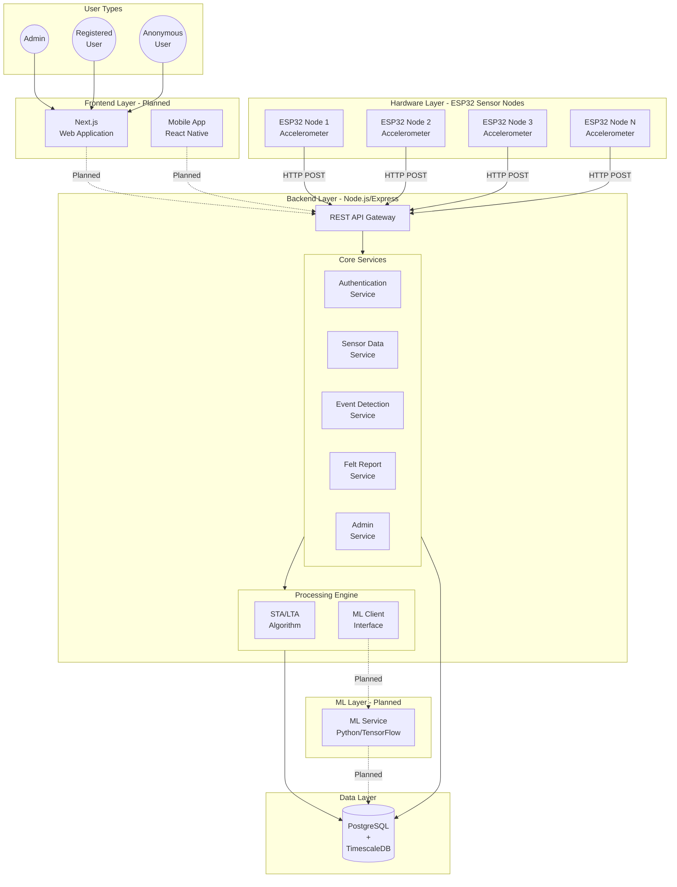

### 3.2 Backend Architecture Detail

```mermaid
flowchart LR
    subgraph Client [Clients]
        ESP[ESP32 Nodes]
        Web[Web Frontend]
        Mobile[Mobile App]
    end

    subgraph Middleware [Middleware Stack]
        Helmet[Helmet<br/>Security]
        CORS[CORS]
        RateLimit[Rate Limiter]
        BodyParser[Body Parser]
        Logger[Winston Logger]
    end

    subgraph Auth [Authentication]
        JWT[JWT Verification]
        RBAC[Role-Based<br/>Access Control]
    end

    subgraph Routes [API Routes]
        AuthRoutes[/api/auth]
        SensorRoutes[/api/sensors]
        EventRoutes[/api/events]
        FeltRoutes[/api/felt]
        AdminRoutes[/api/admin]
    end

    subgraph Controllers [Controllers]
        AuthCtrl[auth.controller]
        SensorCtrl[sensor.controller]
        EventCtrl[event.controller]
        FeltCtrl[felt.controller]
        AdminCtrl[admin.controller]
    end

    subgraph Models [Data Models]
        UserModel[user.model]
        SensorNodeModel[sensorNode.model]
        SensorDataModel[sensorData.model]
        EventModel[event.model]
        FeltModel[feltReport.model]
        PredModel[prediction.model]
        LogModel[adminLog.model]
    end

    subgraph DB [Database]
        PG[(PostgreSQL<br/>TimescaleDB)]
    end

    Client --> Middleware
    Middleware --> Auth
    Auth --> Routes
    Routes --> Controllers
    Controllers --> Models
    Models --> DB
```

---

## 4. Data Flow Diagrams

### 4.1 Sensor Data Ingestion Flow

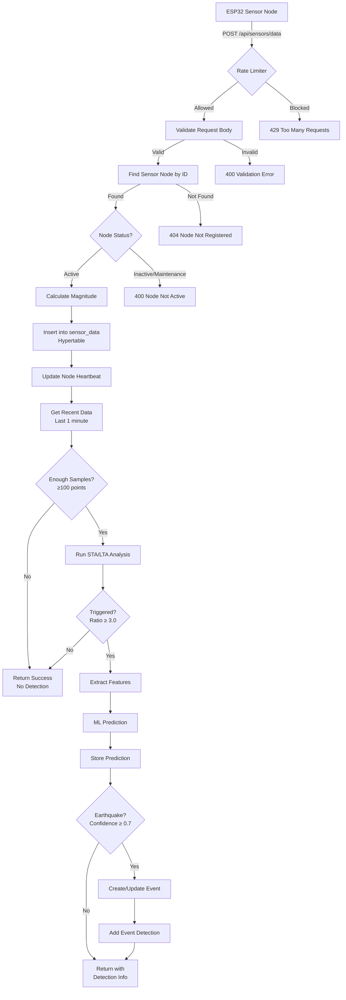

### 4.2 User Authentication Flow

```mermaid
flowchart TD
    subgraph Registration [User Registration]
        R1[POST /api/auth/register] --> R2[Validate Email/Password]
        R2 -->|Valid| R3[Check Email Exists]
        R2 -->|Invalid| RZ1[400 Validation Error]
        R3 -->|Exists| RZ2[409 Email Already Registered]
        R3 -->|New| R4[Hash Password with bcrypt]
        R4 --> R5[Insert User Record]
        R5 --> R6[Generate JWT Tokens]
        R6 --> R7[Return User + Tokens]
    end

    subgraph Login [User Login]
        L1[POST /api/auth/login] --> L2[Validate Credentials]
        L2 -->|Valid| L3[Find User by Email]
        L2 -->|Invalid| LZ1[400 Validation Error]
        L3 -->|Not Found| LZ2[401 Invalid Credentials]
        L3 -->|Found| L4[Compare Password Hash]
        L4 -->|Match| L5[Update Last Login]
        L4 -->|No Match| LZ2
        L5 --> L6[Generate JWT Tokens]
        L6 --> L7[Return User + Tokens]
    end

    subgraph Protected [Protected Request]
        P1[Request with Bearer Token] --> P2[Extract Token from Header]
        P2 --> P3[Verify JWT Signature]
        P3 -->|Valid| P4[Decode User ID]
        P3 -->|Invalid/Expired| PZ1[401 Unauthorized]
        P4 --> P5[Find User in DB]
        P5 -->|Active| P6[Attach User to Request]
        P5 -->|Inactive| PZ2[403 Account Deactivated]
        P6 --> P7[Continue to Route Handler]
    end
```

### 4.3 Felt Report Submission Flow

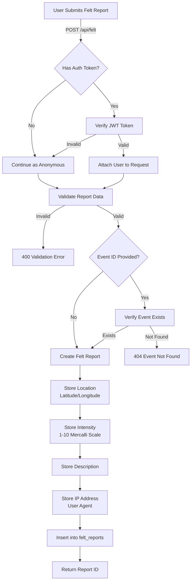

### 4.4 Event Detection Pipeline

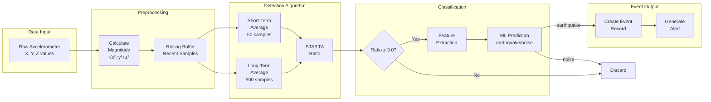

---

## 5. Database Design (ER Diagram)

### 5.1 Entity-Relationship Diagram

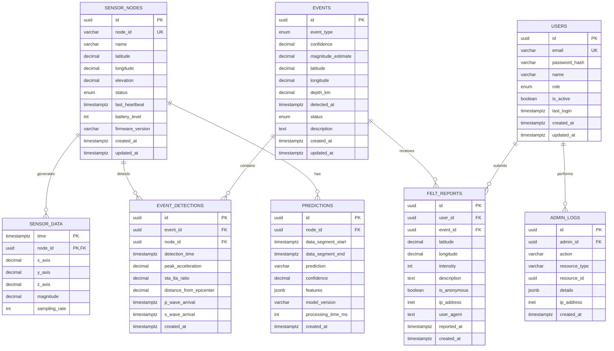

### 5.2 Database Tables Summary

| Table | Description | Record Type | TimescaleDB |
|-------|-------------|-------------|-------------|
| `sensor_nodes` | Registered ESP32 sensor nodes | Metadata | No |
| `sensor_data` | Time-series accelerometer readings | Time-series | **Hypertable** |
| `events` | Detected seismic events | Metadata | No |
| `event_detections` | Links nodes to events | Junction | No |
| `users` | Registered users and admins | Metadata | No |
| `felt_reports` | Crowd-sourced earthquake reports | User data | No |
| `predictions` | ML model predictions | Time-series | No |
| `admin_logs` | Audit trail for admin actions | Audit | No |

### 5.3 Enum Types

```sql
-- Node Status
CREATE TYPE node_status AS ENUM ('active', 'inactive', 'maintenance');

-- Event Type
CREATE TYPE event_type AS ENUM ('earthquake', 'noise', 'unknown');

-- Event Status
CREATE TYPE event_status AS ENUM ('pending', 'confirmed', 'false_positive');

-- User Role
CREATE TYPE user_role AS ENUM ('user', 'admin');
```

### 5.4 TimescaleDB Hypertable Configuration

```sql
-- Convert sensor_data to hypertable (partitioned by time)
SELECT create_hypertable('sensor_data', 'time', 
    if_not_exists => TRUE,
    chunk_time_interval => INTERVAL '1 day'
);

-- Continuous aggregate for hourly statistics
CREATE MATERIALIZED VIEW sensor_data_hourly
WITH (timescaledb.continuous) AS
SELECT
    time_bucket('1 hour', time) AS bucket,
    node_id,
    AVG(magnitude) AS avg_magnitude,
    MAX(magnitude) AS max_magnitude,
    MIN(magnitude) AS min_magnitude,
    COUNT(*) AS sample_count
FROM sensor_data
GROUP BY time_bucket('1 hour', time), node_id;
```

---

## 6. Project Structure

### 6.1 Backend Folder Structure

```
backend/
├── docker-compose.yml          # Docker configuration for TimescaleDB
├── env.sample                  # Environment variables template
├── package.json                # Node.js dependencies
├── DOCKER_SETUP.md             # Docker setup guide
├── POSTMAN_TESTING_GUIDE.md    # API testing guide
├── README.md                   # Project documentation
│
├── migrations/
│   └── 001_initial_schema.sql  # Database schema with all tables
│
└── src/
    ├── server.js               # Application entry point
    ├── app.js                  # Express app configuration
    │
    ├── config/
    │   ├── db.js               # PostgreSQL connection pool
    │   ├── jwt.js              # JWT configuration
    │   └── timescale.js        # TimescaleDB initialization
    │
    ├── controllers/
    │   ├── auth.controller.js      # Authentication logic
    │   ├── sensor.controller.js    # Sensor data handling
    │   ├── event.controller.js     # Event management
    │   ├── felt.controller.js      # Felt reports handling
    │   └── admin.controller.js     # Admin operations
    │
    ├── models/
    │   ├── user.model.js           # User CRUD operations
    │   ├── sensorNode.model.js     # Sensor node operations
    │   ├── sensorData.model.js     # Time-series data operations
    │   ├── event.model.js          # Event operations
    │   ├── feltReport.model.js     # Felt report operations
    │   ├── prediction.model.js     # ML prediction storage
    │   └── adminLog.model.js       # Audit logging
    │
    ├── routes/
    │   ├── auth.routes.js          # /api/auth/*
    │   ├── sensor.routes.js        # /api/sensors/*
    │   ├── event.routes.js         # /api/events/*
    │   ├── felt.routes.js          # /api/felt/*
    │   └── admin.routes.js         # /api/admin/*
    │
    ├── middlewares/
    │   ├── auth.middleware.js      # JWT verification, RBAC
    │   ├── error.middleware.js     # Error handling
    │   └── validation.middleware.js # Request validation
    │
    └── utils/
        ├── logger.js               # Winston logging
        ├── validators.js           # Joi validation schemas
        ├── staLta.js               # STA/LTA algorithm
        ├── mlClient.js             # ML service client
        └── geo.js                  # Geographic utilities
```

### 6.2 File Statistics

| Category | Count | Description |
|----------|-------|-------------|
| Controllers | 5 | Business logic handlers |
| Models | 7 | Database access layer |
| Routes | 5 | API endpoint definitions |
| Middlewares | 3 | Request processing |
| Utilities | 5 | Helper functions |
| Config | 3 | System configuration |
| **Total Source Files** | **28** | |

---

## 7. API Endpoint Catalog

### 7.1 Authentication Endpoints (`/api/auth`)

| Method | Endpoint | Description | Auth |
|--------|----------|-------------|------|
| `POST` | `/api/auth/register` | Register new user | Public |
| `POST` | `/api/auth/login` | User login | Public |
| `POST` | `/api/auth/refresh` | Refresh access token | Public |
| `GET` | `/api/auth/me` | Get current user profile | User |
| `PUT` | `/api/auth/me` | Update user profile | User |
| `PUT` | `/api/auth/password` | Change password | User |
| `POST` | `/api/auth/logout` | Logout user | User |
| `POST` | `/api/auth/create-admin` | Create admin user | Admin |

### 7.2 Sensor Endpoints (`/api/sensors`)

| Method | Endpoint | Description | Auth |
|--------|----------|-------------|------|
| `POST` | `/api/sensors/data` | Ingest single data point | Public (ESP32) |
| `POST` | `/api/sensors/data/batch` | Ingest batch data | Public (ESP32) |
| `POST` | `/api/sensors/heartbeat` | Node heartbeat | Public (ESP32) |
| `GET` | `/api/sensors/nodes` | Get all sensor nodes | Admin |
| `GET` | `/api/sensors/nodes/:nodeId` | Get specific node | Admin |
| `GET` | `/api/sensors/data/:nodeId` | Get node data | Admin |
| `GET` | `/api/sensors/data/:nodeId/aggregates` | Get aggregated data | Admin |

### 7.3 Event Endpoints (`/api/events`)

| Method | Endpoint | Description | Auth |
|--------|----------|-------------|------|
| `GET` | `/api/events` | List events (paginated) | Public |
| `GET` | `/api/events/recent` | Get recent events (24h) | Public |
| `GET` | `/api/events/nearby` | Get events near location | Public |
| `GET` | `/api/events/stats` | Get event statistics | Public |
| `GET` | `/api/events/:id` | Get event details | Public |
| `GET` | `/api/events/:id/detections` | Get event detections | Public |
| `POST` | `/api/events` | Create event manually | Admin |
| `PUT` | `/api/events/:id/status` | Update event status | Admin |
| `DELETE` | `/api/events/:id` | Delete event | Admin |

### 7.4 Felt Report Endpoints (`/api/felt`)

| Method | Endpoint | Description | Auth |
|--------|----------|-------------|------|
| `GET` | `/api/felt/intensity-scale` | Get Mercalli scale reference | Public |
| `POST` | `/api/felt` | Submit felt report | Optional |
| `GET` | `/api/felt/nearby` | Get nearby reports | Public |
| `GET` | `/api/felt/recent` | Get recent reports | Public |
| `GET` | `/api/felt/stats` | Get report statistics | Public |
| `GET` | `/api/felt/event/:eventId` | Get reports for event | Public |
| `GET` | `/api/felt/:id` | Get specific report | Public |
| `DELETE` | `/api/felt/:id` | Delete report | Admin |

### 7.5 Admin Endpoints (`/api/admin`)

| Method | Endpoint | Description | Auth |
|--------|----------|-------------|------|
| `GET` | `/api/admin/dashboard` | Get dashboard data | Admin |
| `GET` | `/api/admin/stats` | Get system statistics | Admin |
| `GET` | `/api/admin/nodes` | Get all sensor nodes | Admin |
| `POST` | `/api/admin/nodes` | Register new node | Admin |
| `PUT` | `/api/admin/nodes/:nodeId` | Update node | Admin |
| `DELETE` | `/api/admin/nodes/:nodeId` | Deactivate node | Admin |
| `GET` | `/api/admin/users` | Get all users | Admin |
| `PUT` | `/api/admin/users/:userId` | Update user | Admin |
| `DELETE` | `/api/admin/users/:userId` | Deactivate user | Admin |
| `GET` | `/api/admin/logs` | Get audit logs | Admin |
| `GET` | `/api/admin/logs/recent` | Get recent activity | Admin |
| `GET` | `/api/admin/database` | Get database info | Admin |
| `POST` | `/api/admin/cleanup` | Cleanup old data | Admin |

### 7.6 System Endpoints

| Method | Endpoint | Description | Auth |
|--------|----------|-------------|------|
| `GET` | `/health` | Health check | Public |

### 7.7 Endpoint Summary

| Module | Public | User | Admin | Total |
|--------|--------|------|-------|-------|
| Authentication | 3 | 4 | 1 | **8** |
| Sensors | 3 | 0 | 4 | **7** |
| Events | 6 | 0 | 3 | **9** |
| Felt Reports | 6 | 0 | 1 | **7** |
| Admin | 0 | 0 | 13 | **13** |
| System | 1 | 0 | 0 | **1** |
| **Total** | **19** | **4** | **22** | **45** |

---

## 8. Sample API Requests and Responses

### 8.1 User Registration

**Request:**
```http
POST /api/auth/register
Content-Type: application/json

{
  "email": "john.doe@example.com",
  "password": "SecurePass123!",
  "name": "John Doe"
}
```

**Response (201 Created):**
```json
{
  "success": true,
  "message": "User registered successfully",
  "data": {
    "user": {
      "id": "550e8400-e29b-41d4-a716-446655440000",
      "email": "john.doe@example.com",
      "name": "John Doe",
      "role": "user",
      "created_at": "2026-01-27T10:30:00.000Z"
    },
    "tokens": {
      "accessToken": "eyJhbGciOiJIUzI1NiIsInR5cCI6IkpXVCJ9...",
      "refreshToken": "eyJhbGciOiJIUzI1NiIsInR5cCI6IkpXVCJ9...",
      "expiresIn": "1h"
    }
  }
}
```

### 8.2 User Login

**Request:**
```http
POST /api/auth/login
Content-Type: application/json

{
  "email": "john.doe@example.com",
  "password": "SecurePass123!"
}
```

**Response (200 OK):**
```json
{
  "success": true,
  "message": "Login successful",
  "data": {
    "user": {
      "id": "550e8400-e29b-41d4-a716-446655440000",
      "email": "john.doe@example.com",
      "name": "John Doe",
      "role": "user",
      "last_login": "2026-01-27T10:35:00.000Z"
    },
    "tokens": {
      "accessToken": "eyJhbGciOiJIUzI1NiIsInR5cCI6IkpXVCJ9...",
      "refreshToken": "eyJhbGciOiJIUzI1NiIsInR5cCI6IkpXVCJ9...",
      "expiresIn": "1h"
    }
  }
}
```

### 8.3 Sensor Data Ingestion (Single Point)

**Request:**
```http
POST /api/sensors/data
Content-Type: application/json

{
  "node_id": "ESP32_NODE_001",
  "x": 0.0234,
  "y": -0.0156,
  "z": 0.9812,
  "sampling_rate": 100,
  "timestamp": "2026-01-27T10:30:00.123Z"
}
```

**Response (201 Created):**
```json
{
  "success": true,
  "data": {
    "time": "2026-01-27T10:30:00.123Z",
    "magnitude": 0.9817,
    "detection": null
  }
}
```

**Response with Detection:**
```json
{
  "success": true,
  "data": {
    "time": "2026-01-27T10:30:00.123Z",
    "magnitude": 1.4523,
    "detection": {
      "sta_lta_triggered": true,
      "sta_lta_ratio": 4.25,
      "prediction": "earthquake",
      "confidence": 0.8734
    }
  }
}
```

### 8.4 Batch Sensor Data Ingestion

**Request:**
```http
POST /api/sensors/data/batch
Content-Type: application/json

{
  "node_id": "ESP32_NODE_001",
  "sampling_rate": 100,
  "data": [
    {"x": 0.0234, "y": -0.0156, "z": 0.9812, "timestamp": "2026-01-27T10:30:00.000Z"},
    {"x": 0.0245, "y": -0.0167, "z": 0.9823, "timestamp": "2026-01-27T10:30:00.010Z"},
    {"x": 0.0256, "y": -0.0178, "z": 0.9834, "timestamp": "2026-01-27T10:30:00.020Z"}
  ]
}
```

**Response (201 Created):**
```json
{
  "success": true,
  "data": {
    "inserted_count": 3,
    "detection": null
  }
}
```

### 8.5 Register Sensor Node

**Request:**
```http
POST /api/admin/nodes
Authorization: Bearer <admin_token>
Content-Type: application/json

{
  "node_id": "ESP32_NODE_001",
  "name": "Downtown Sensor Alpha",
  "latitude": 9.0054,
  "longitude": 38.7636,
  "elevation": 2355.5,
  "status": "active",
  "firmware_version": "1.0.0"
}
```

**Response (201 Created):**
```json
{
  "success": true,
  "message": "Sensor node registered successfully",
  "data": {
    "id": "660e8400-e29b-41d4-a716-446655440001",
    "node_id": "ESP32_NODE_001",
    "name": "Downtown Sensor Alpha",
    "latitude": "9.0054000",
    "longitude": "38.7636000",
    "elevation": "2355.50",
    "status": "active",
    "firmware_version": "1.0.0",
    "created_at": "2026-01-27T10:00:00.000Z"
  }
}
```

### 8.6 Get Events List

**Request:**
```http
GET /api/events?page=1&limit=10&status=confirmed&event_type=earthquake
```

**Response (200 OK):**
```json
{
  "success": true,
  "data": {
    "events": [
      {
        "id": "770e8400-e29b-41d4-a716-446655440002",
        "event_type": "earthquake",
        "confidence": 0.8734,
        "magnitude_estimate": 4.2,
        "latitude": "9.0054000",
        "longitude": "38.7636000",
        "depth_km": "10.50",
        "detected_at": "2026-01-27T08:15:32.000Z",
        "status": "confirmed",
        "description": "Moderate earthquake detected by 3 sensors"
      }
    ],
    "pagination": {
      "page": 1,
      "limit": 10,
      "total": 1,
      "pages": 1
    }
  }
}
```

### 8.7 Submit Felt Report

**Request:**
```http
POST /api/felt
Authorization: Bearer <user_token>  (optional)
Content-Type: application/json

{
  "latitude": 9.0120,
  "longitude": 38.7580,
  "intensity": 5,
  "description": "Felt moderate shaking for about 10 seconds. Items on shelves moved.",
  "event_id": "770e8400-e29b-41d4-a716-446655440002",
  "is_anonymous": false
}
```

**Response (201 Created):**
```json
{
  "success": true,
  "message": "Felt report submitted successfully",
  "data": {
    "id": "880e8400-e29b-41d4-a716-446655440003",
    "latitude": "9.0120000",
    "longitude": "38.7580000",
    "intensity": 5,
    "description": "Felt moderate shaking for about 10 seconds. Items on shelves moved.",
    "event_id": "770e8400-e29b-41d4-a716-446655440002",
    "reported_at": "2026-01-27T08:20:15.000Z"
  }
}
```

### 8.8 Get Admin Dashboard

**Request:**
```http
GET /api/admin/dashboard
Authorization: Bearer <admin_token>
```

**Response (200 OK):**
```json
{
  "success": true,
  "data": {
    "summary": {
      "total_nodes": 15,
      "active_nodes": 12,
      "inactive_nodes": 2,
      "maintenance_nodes": 1,
      "total_events": 47,
      "confirmed_events": 35,
      "pending_events": 8,
      "false_positives": 4,
      "total_felt_reports": 234,
      "total_users": 156
    },
    "recent_events": [
      {
        "id": "770e8400-e29b-41d4-a716-446655440002",
        "event_type": "earthquake",
        "magnitude_estimate": 4.2,
        "detected_at": "2026-01-27T08:15:32.000Z",
        "status": "confirmed"
      }
    ],
    "sensor_health": {
      "healthy": 12,
      "warning": 2,
      "critical": 1
    },
    "data_stats": {
      "total_data_points": 15234567,
      "data_points_last_24h": 432000,
      "avg_sampling_rate": 100
    }
  }
}
```

### 8.9 Error Response Examples

**Validation Error (400):**
```json
{
  "success": false,
  "error": "Validation failed",
  "details": [
    {
      "field": "email",
      "message": "\"email\" must be a valid email"
    }
  ]
}
```

**Unauthorized (401):**
```json
{
  "success": false,
  "error": "Authentication required",
  "message": "No token provided"
}
```

**Forbidden (403):**
```json
{
  "success": false,
  "error": "Access denied",
  "message": "Admin privileges required"
}
```

**Not Found (404):**
```json
{
  "success": false,
  "error": "Resource not found",
  "message": "Sensor node 'ESP32_NODE_999' not registered"
}
```

**Rate Limited (429):**
```json
{
  "success": false,
  "error": "Too many requests, please try again later."
}
```

---

## 9. Key Algorithms

### 9.1 STA/LTA (Short-Term Average / Long-Term Average)

The STA/LTA algorithm is a classic seismological method for automatic earthquake detection. It compares short-term signal average to long-term average to detect sudden increases in ground motion.

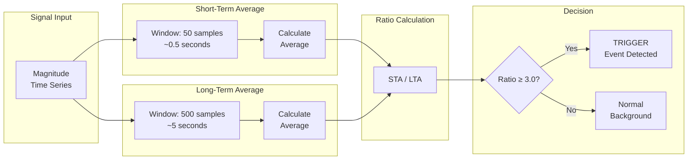

**Algorithm Parameters:**

| Parameter | Default Value | Description |
|-----------|---------------|-------------|
| STA Window | 50 samples | Short-term averaging window |
| LTA Window | 500 samples | Long-term averaging window |
| Trigger Threshold | 3.0 | Ratio to trigger event |
| Detrigger Threshold | 1.5 | Ratio to end event |

**Implementation:**
```javascript
function calculateRatio(signal, index, staWindow, ltaWindow) {
  // Calculate STA (most recent samples)
  let staSum = 0;
  for (let i = index - staWindow + 1; i <= index; i++) {
    staSum += Math.abs(signal[i]);
  }
  const sta = staSum / staWindow;

  // Calculate LTA (preceding samples)
  let ltaSum = 0;
  for (let i = index - ltaWindow - staWindow + 1; i <= index - staWindow; i++) {
    ltaSum += Math.abs(signal[i]);
  }
  const lta = ltaSum / ltaWindow;

  return sta / lta;
}
```

### 9.2 Magnitude Calculation

The magnitude of ground motion is calculated from the 3-axis accelerometer readings:

```
Magnitude = √(x² + y² + z²)
```

Where:
- `x` = X-axis acceleration (g)
- `y` = Y-axis acceleration (g)
- `z` = Z-axis acceleration (g)

### 9.3 ML Classification (Placeholder)

The ML client is prepared for integration with an external ML service. Currently, it uses a placeholder heuristic:

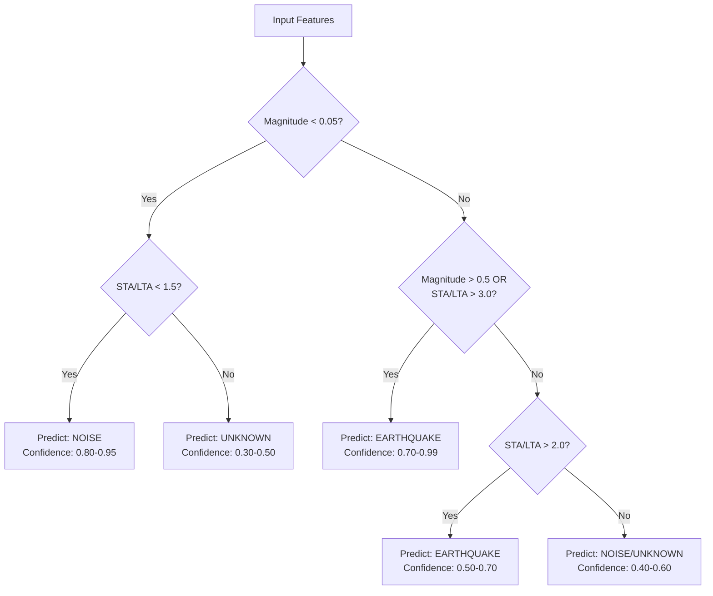

---

## 10. Sequence Diagrams

### 10.1 Complete Sensor Data Ingestion Sequence

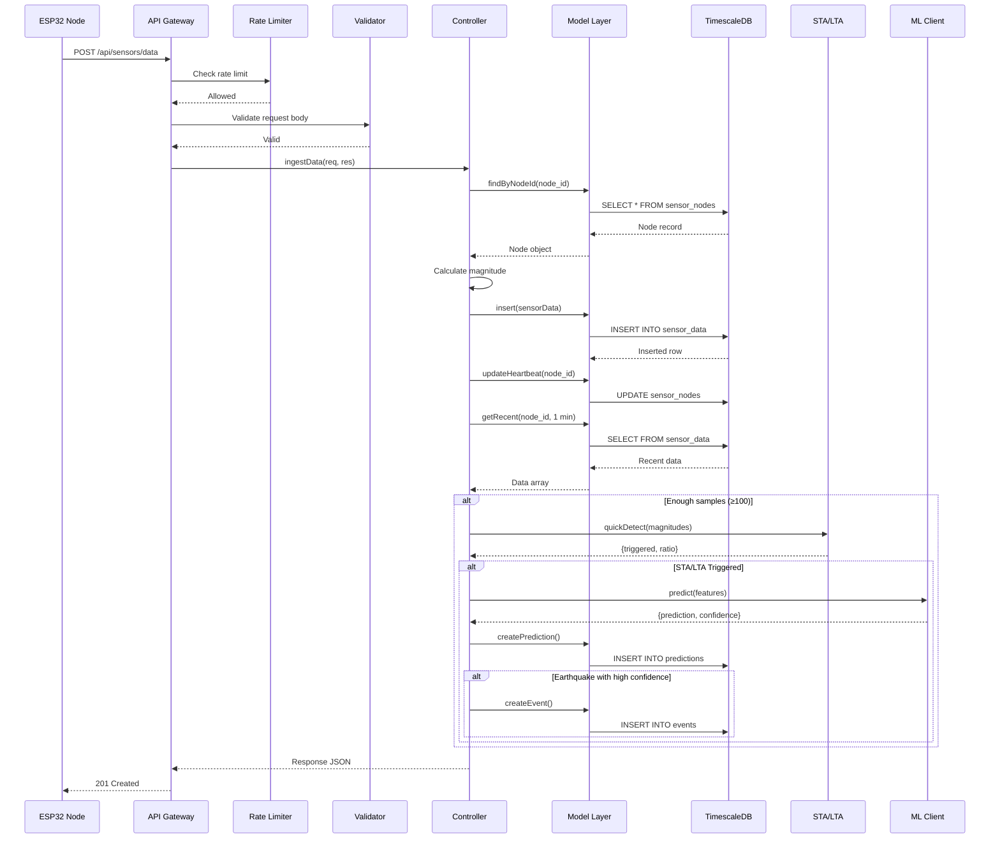

### 10.2 User Authentication Sequence

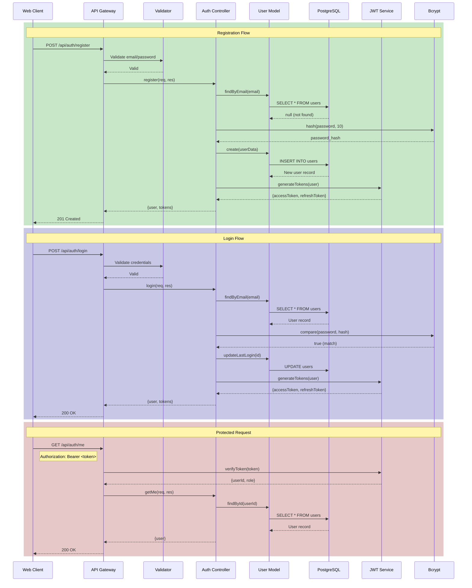

### 10.3 Event Detection and Alert Sequence

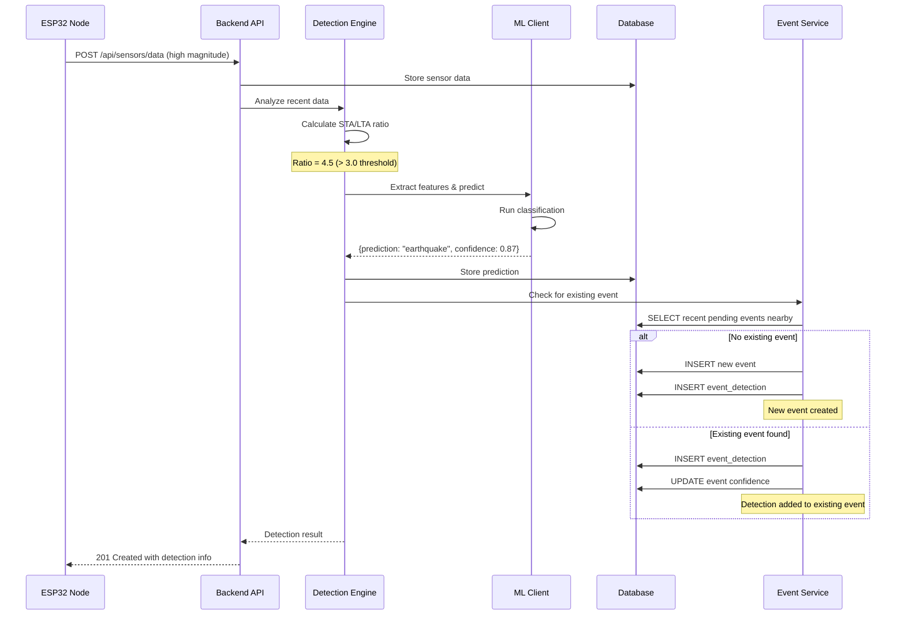

---

## 11. Technology Stack

### 11.1 Backend Technologies

| Category | Technology | Version | Purpose |
|----------|------------|---------|---------|
| Runtime | Node.js | ≥18.0.0 | JavaScript runtime |
| Framework | Express | 4.21.0 | Web framework |
| Database | PostgreSQL | 16 | Relational database |
| Time-Series | TimescaleDB | 2.x | Time-series extension |
| Auth | jsonwebtoken | 9.0.2 | JWT tokens |
| Password | bcrypt | 5.1.1 | Password hashing |
| Validation | Joi | 17.13.3 | Schema validation |
| Security | Helmet | 7.1.0 | HTTP headers security |
| CORS | cors | 2.8.5 | Cross-origin requests |
| Rate Limit | express-rate-limit | 7.4.0 | API rate limiting |
| Logging | Winston | 3.14.2 | Structured logging |
| DB Client | pg | 8.12.0 | PostgreSQL client |
| UUID | uuid | 10.0.0 | UUID generation |

### 11.2 Development Tools

| Tool | Version | Purpose |
|------|---------|---------|
| nodemon | 3.1.4 | Development auto-reload |
| Docker | Latest | Container platform |
| Docker Compose | 3.8 | Multi-container orchestration |
| Postman | Latest | API testing |

### 11.3 Planned Technologies

| Category | Technology | Purpose |
|----------|------------|---------|
| Frontend | Next.js 14 | React framework |
| Styling | Tailwind CSS | Utility-first CSS |
| Charts | Chart.js / D3.js | Data visualization |
| Maps | Leaflet / Mapbox | Geographic visualization |
| ML Service | Python/FastAPI | ML model serving |
| ML Framework | TensorFlow/PyTorch | Model training |
| Real-time | Socket.io | WebSocket communication |
| Hardware | ESP32 | Microcontroller |
| Sensor | MPU6050 / ADXL345 | Accelerometer |

---

## 12. Implementation Status

### 12.1 Completed Components (Backend - 100%)

| Component | Status | Files | Description |
|-----------|--------|-------|-------------|
| **Database Schema** | ✅ Complete | 1 | 8 tables, indexes, triggers, hypertable |
| **TimescaleDB Integration** | ✅ Complete | 1 | Hypertable, continuous aggregates |
| **Authentication System** | ✅ Complete | 4 | JWT, bcrypt, refresh tokens |
| **Role-Based Access Control** | ✅ Complete | 1 | Admin, User, Anonymous |
| **Sensor Data Ingestion** | ✅ Complete | 3 | Single, batch, heartbeat |
| **Event Management** | ✅ Complete | 3 | CRUD, detection tracking |
| **Felt Report System** | ✅ Complete | 3 | Submission, stats, queries |
| **Admin Dashboard API** | ✅ Complete | 2 | Stats, node management |
| **STA/LTA Algorithm** | ✅ Complete | 1 | Trigger detection |
| **ML Client Interface** | ✅ Complete | 1 | Placeholder + integration ready |
| **Validation Layer** | ✅ Complete | 2 | Joi schemas |
| **Error Handling** | ✅ Complete | 1 | Global error middleware |
| **Logging** | ✅ Complete | 1 | Winston structured logging |
| **Rate Limiting** | ✅ Complete | 1 | API protection |
| **Security Headers** | ✅ Complete | 1 | Helmet integration |
| **Docker Setup** | ✅ Complete | 2 | docker-compose, documentation |
| **API Documentation** | ✅ Complete | 2 | Postman guide, testing docs |

**Total: 28 source files implemented**

### 12.2 Remaining Work

| Component | Priority | Effort | Dependencies |
|-----------|----------|--------|--------------|
| **ESP32 Firmware** | High | 2-3 weeks | Hardware available |
| **ML Model Training** | High | 3-4 weeks | Training data |
| **ML Service Deployment** | High | 1 week | Model trained |
| **Next.js Frontend** | High | 4-5 weeks | Backend complete ✅ |
| **Real-time Visualization** | Medium | 1-2 weeks | Frontend started |
| **WebSocket Integration** | Medium | 1 week | Frontend started |
| **Push Notifications** | Low | 1 week | Frontend complete |
| **Mobile App** | Low | 4-6 weeks | Frontend complete |

### 12.3 Progress Summary

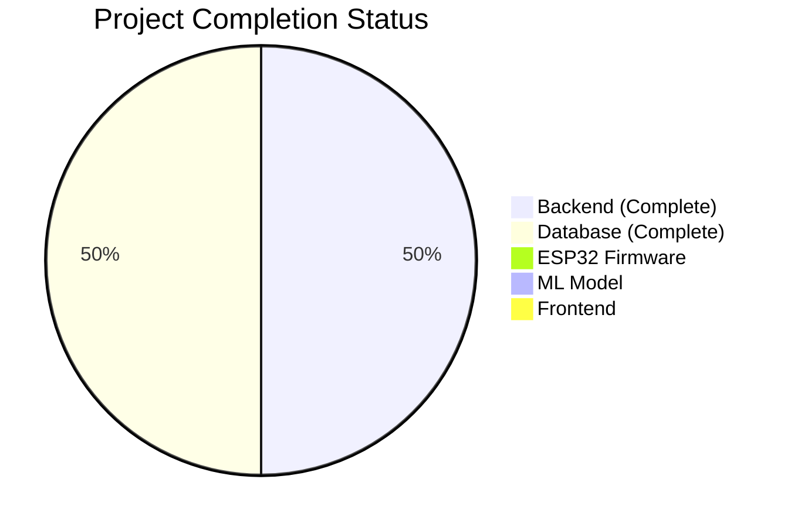

| Phase | Progress | Status |
|-------|----------|--------|
| Backend Development | 100% | ✅ Complete |
| Database Design | 100% | ✅ Complete |
| API Implementation | 100% | ✅ Complete |
| ESP32 Firmware | 0% | 🔴 Not Started |
| ML Model | 0% | 🔴 Not Started |
| Frontend | 0% | 🔴 Not Started |
| **Overall Project** | **~35%** | 🟡 In Progress |

---

## 13. Challenges and Solutions

### 13.1 Technical Challenges

| Challenge | Solution |
|-----------|----------|
| **High-frequency time-series data storage** | Used TimescaleDB with hypertables for automatic partitioning and efficient queries |
| **Real-time event detection** | Implemented STA/LTA algorithm with configurable windows and thresholds |
| **Scalable sensor data ingestion** | Batch ingestion endpoint and rate limiting per sensor node |
| **Secure authentication** | JWT with refresh tokens, bcrypt password hashing, role-based access |
| **Database connection pooling** | pg Pool with configurable connection limits and timeout handling |
| **Request validation** | Joi schemas with detailed error messages |

### 13.2 Design Decisions

| Decision | Rationale |
|----------|-----------|
| **PostgreSQL + TimescaleDB over InfluxDB** | Better relational support for complex queries, familiar SQL syntax, strong ecosystem |
| **Express over Fastify** | Mature ecosystem, extensive middleware support, team familiarity |
| **JWT over Sessions** | Stateless authentication suitable for distributed systems and mobile apps |
| **Placeholder ML Client** | Allows backend development to proceed while ML model is being trained |
| **UUID for all primary keys** | Enables distributed ID generation, better security than sequential IDs |

---

## 14. Next Steps

### 14.1 Immediate Priorities (Next 2 Weeks)

1. **Start ESP32 Firmware Development**
   - Set up development environment
   - Implement WiFi connectivity
   - Interface with accelerometer sensor
   - Implement HTTP client for data transmission

2. **Begin ML Model Training**
   - Collect/acquire training dataset
   - Design model architecture
   - Start training experiments

### 14.2 Short-Term Goals (Next Month)

1. Complete ESP32 firmware with data transmission
2. Train and validate ML classification model
3. Begin Next.js frontend development
4. Implement real-time data visualization

### 14.3 Long-Term Goals (Project Completion)

1. Full system integration testing
2. Field deployment of sensor nodes
3. Performance optimization
4. Documentation and thesis writing

---

## Appendix A: Environment Configuration

### Required Environment Variables

```env
# Database
DB_HOST=localhost
DB_PORT=5433
DB_NAME=seismic_db
DB_USER=postgres
DB_PASSWORD=your_password

# JWT
JWT_SECRET=your_jwt_secret
JWT_EXPIRES_IN=1h
JWT_REFRESH_EXPIRES_IN=7d

# Server
PORT=3000
NODE_ENV=development

# CORS
FRONTEND_URL=http://localhost:3001

# ML Service (when ready)
ML_SERVICE_URL=http://localhost:5000
ML_ENABLED=false

# Detection Thresholds
EVENT_CONFIDENCE_THRESHOLD=0.7
STA_LTA_THRESHOLD=3.0
EVENT_TIME_WINDOW_MS=60000

# Rate Limiting
RATE_LIMIT_WINDOW_MS=900000
RATE_LIMIT_MAX_REQUESTS=100
```

---

## Appendix B: Quick Start Guide

### Prerequisites

- Node.js ≥ 18.0.0
- Docker and Docker Compose
- PostgreSQL client (optional)

### Setup Steps

```bash
# 1. Clone repository
git clone <repository-url>
cd RiftSense/backend

# 2. Install dependencies
npm install

# 3. Start database
docker-compose up -d

# 4. Create environment file
cp env.sample .env
# Edit .env with your settings

# 5. Run migrations
npm run migrate

# 6. Start server
npm run dev

# Server running at http://localhost:3000
```

### Verify Installation

```bash
# Health check
curl http://localhost:3000/health

# Expected response:
# {"success":true,"message":"Seismic Sensor Backend is running","timestamp":"..."}
```

---

*Document generated for Mid-Progress Thesis Defense - January 2026*

