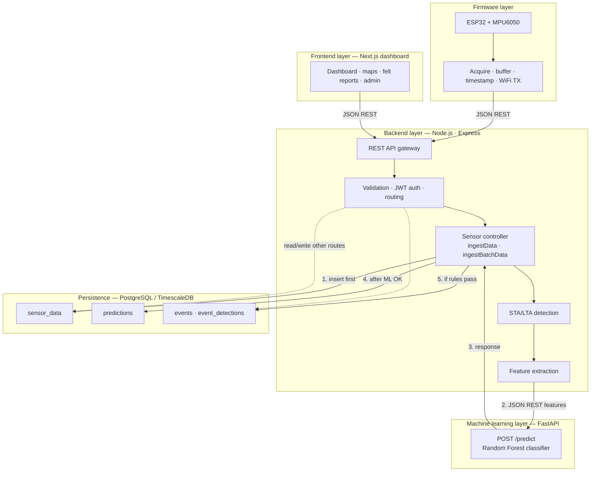
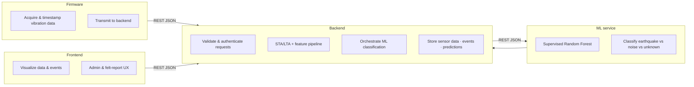
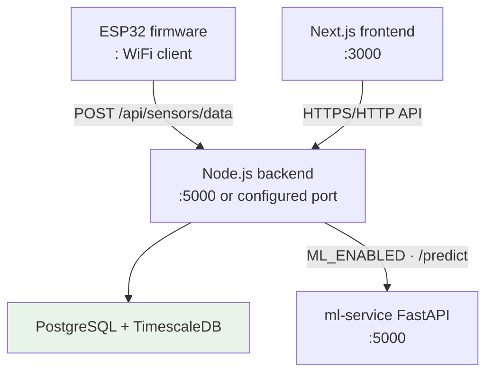
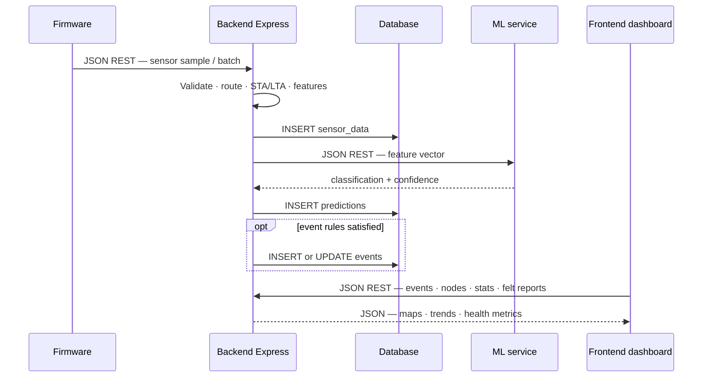

# RiftSense — Software Architecture

Service-oriented design across firmware, backend, machine learning, and frontend. Inter-service communication uses JSON REST APIs.

## High-level architecture



**Note:** ML does **not** call back into validation/routing. The **sensor controller** calls ML, receives the response, then writes `predictions` and optionally `events`. Raw `sensor_data` is written **before** STA/LTA and ML (batch and single ingest).
```

## Layer responsibilities



## Deployment / runtime view



## Request flow — sensor ingest to UI


